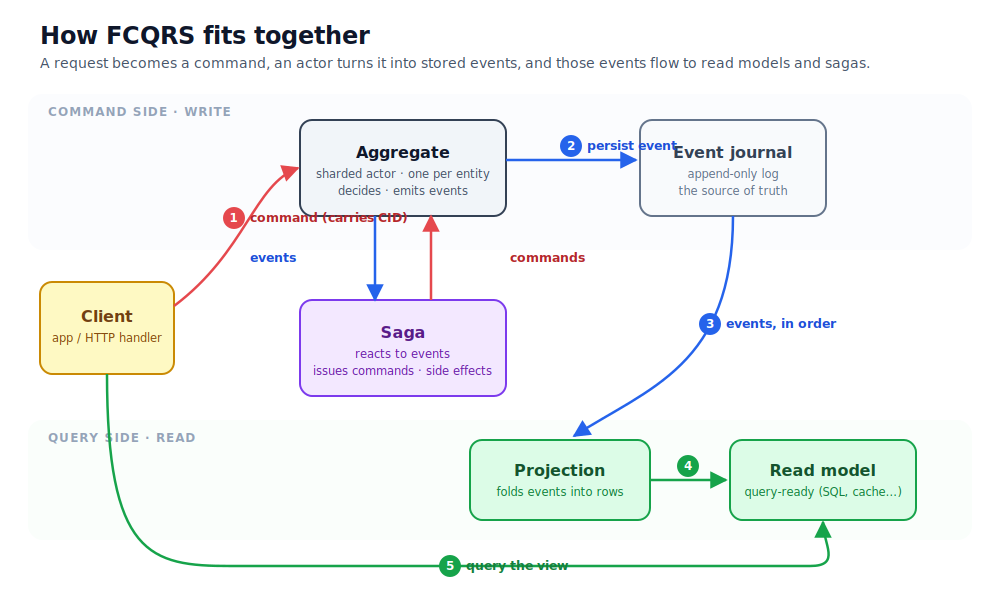

# FCQRS

[](https://www.nuget.org/packages/FCQRS)
[](https://www.nuget.org/packages/FCQRS)
[](https://github.com/OnurGumus/FCQRS/actions/workflows/ci.yaml)

FCQRS is an F# framework for CQRS and event-sourced applications on Akka.NET. It is also usable from
C#. You write the functions that make domain decisions and rebuild state. FCQRS supplies the actor
lifecycle, cluster sharding, event persistence, projections, sagas, snapshots, and correlation
subscriptions around them.

[Read the documentation](https://onurgumus.github.io/FCQRS/) or begin with the
[zero-to-production tutorial](https://onurgumus.github.io/FCQRS/tutorial/index.html).



## The model in one example

An order receives `CancelOrder`. Its aggregate checks the current state and returns one outcome:

- `OrderCancelled` is persisted when cancellation is allowed.
- `OrderAlreadyShipped` is returned without persistence when the order can no longer be cancelled.

The decision is made by one actor for that order. Commands for the same order run sequentially, which
eliminates race conditions within the aggregate. Other order actors can run concurrently.

Persisted events rebuild the aggregate after passivation or restart. They also feed projections. One
projection can maintain an order page while another maintains a customer history. A saga coordinates
work that crosses aggregate boundaries, such as reserving stock and taking payment.

## What you write

An aggregate is centred on two pure functions. `decide` maps a command and current state to an action.
`fold` maps a stored event and current state to the next state.

```fsharp
open FCQRS.Common

type State = NotPlaced | Placed | Cancelled | Shipped

type Command =
    | PlaceOrder
    | CancelOrder
    | ShipOrder

type Event =
    | OrderPlaced
    | OrderCancelled
    | OrderShipped
    | OrderAlreadyShipped

let decide (command: FCQRS.Common.Command<Command>) state =
    match command.CommandDetails, state with
    | PlaceOrder, NotPlaced -> OrderPlaced |> PersistEvent
    | CancelOrder, Placed -> OrderCancelled |> PersistEvent
    | CancelOrder, Shipped -> OrderAlreadyShipped |> DeferEvent
    | ShipOrder, Placed -> OrderShipped |> PersistEvent
    | _ -> UnhandledEvent

let fold (event: FCQRS.Common.Event<Event>) state =
    match event.EventDetails with
    | OrderPlaced -> Placed
    | OrderCancelled -> Cancelled
    | OrderShipped -> Shipped
    | OrderAlreadyShipped -> state
```

`PersistEvent` appends a fact, increments the aggregate version, folds it into state, and publishes it.
`DeferEvent` publishes and folds a reply without storing it or incrementing the persisted version. For
a rejection or repeated verdict, write the fold so that this reply leaves state unchanged. Any state
change caused only by a deferred event is lost on recovery because the event is absent from the
journal. The functions contain no actor or database code and can be tested directly.

## What FCQRS guarantees

- **One command at a time within an aggregate.** This eliminates races over that aggregate's state.
- **Recovery from persisted events.** Passivated or restarted aggregates rebuild their state by replay.
- **A safe saga-start order.** FCQRS subscribes a starting saga before publishing its trigger event.
- **Projection coordination.** A correlation subscription signals when a publishing projection has
  handled a command's event.
- **Local and clustered execution.** Aggregate code is unchanged when sharding moves entities between
  nodes.

These guarantees have boundaries. Separate aggregates do not share one transaction. External services
still require timeouts and idempotency. A projection is exactly-once only when its data update and
offset commit in the same transaction. The
[consistency and recovery guide](https://onurgumus.github.io/FCQRS/concepts/consistency-and-recovery.html)
explains the remaining application responsibilities.

## Start learning

| If you want to... | Start here |
|---|---|
| Understand why CQRS has two models | [Overview](https://onurgumus.github.io/FCQRS/overview.html) |
| Run one complete command, projection, and query | [Get started](https://onurgumus.github.io/FCQRS/get-started.html) |
| Learn FCQRS from first principles through production | [Tutorial](https://onurgumus.github.io/FCQRS/tutorial/index.html) |
| Understand aggregates, events, projections, sagas, and recovery | [Concepts](https://onurgumus.github.io/FCQRS/concepts/index.html) |
| Implement one specific task | [How-to guides](https://onurgumus.github.io/FCQRS/how-to/index.html) |
| Build from C# | [C# guide](https://onurgumus.github.io/FCQRS/how-to/use-from-csharp.html) |
| Look up configuration | [Configuration reference](https://onurgumus.github.io/FCQRS/configuration.html) |

## Install

For F# on .NET 10:

```bash
dotnet new console -lang F# -n MyApp
cd MyApp
dotnet add package FCQRS --prerelease
```

C# support uses C# 15 union types. While the feature remains in preview, use a .NET 11 preview SDK and
`<LangVersion>preview</LangVersion>`. Teams that need a stable C# compiler can define the event-sourced
domain in a small F# project and consume it from a C# host.

## When FCQRS fits

FCQRS is useful when an application must protect business rules under concurrent commands, retain an
ordered history, build several query views, or continue multi-step work after a restart.

Its cost is an event journal, asynchronous projections, separate read models, and an actor system to
operate. Data with no behaviour beyond basic create, read, update, and delete may be clearer in a
conventional database application.

## Examples

- [`samples/getting-started-fsharp/`](samples/getting-started-fsharp/) runs the first complete flow in
  F#.
- [`samples/getting-started-csharp/`](samples/getting-started-csharp/) runs the same flow in stable C#
  on .NET 10.
- [`sample/`](sample/) contains a small user aggregate.
- [`saga_sample/`](saga_sample/) adds a verification saga.
- [`focument_workshop`](https://github.com/OnurGumus/focument_workshop) is a C# workshop application.
- [`focument_fsharp`](https://github.com/OnurGumus/focument_fsharp) and
  [`focument-csharp`](https://github.com/OnurGumus/focument-csharp) implement the same document domain in
  both languages.

## License

See [LICENSE.md](LICENSE.md).
