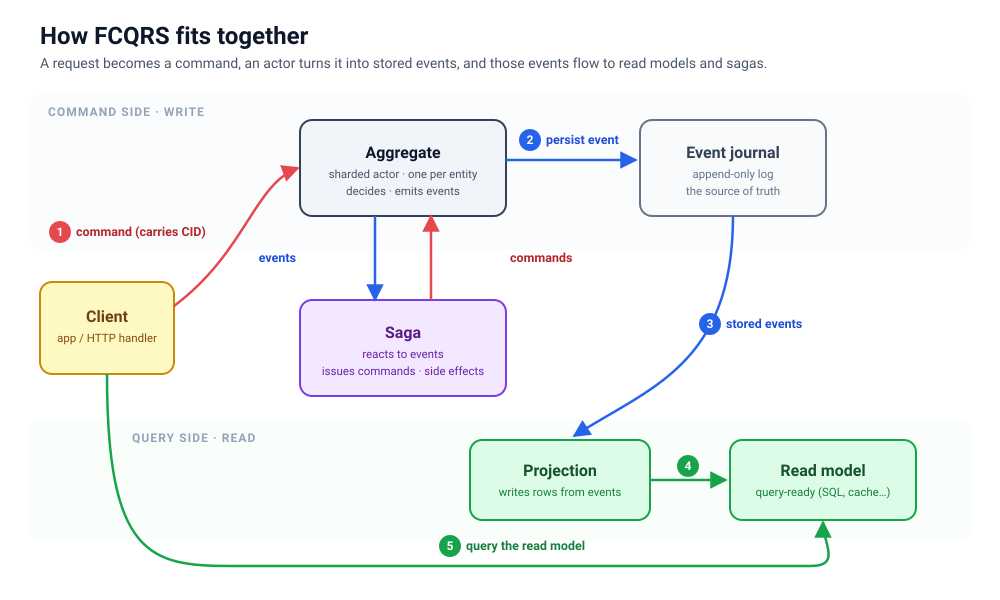

# FCQRS

[](https://www.nuget.org/packages/FCQRS)
[](https://www.nuget.org/packages/FCQRS)
[](https://github.com/OnurGumus/FCQRS/actions/workflows/ci.yaml)

FCQRS is an F# framework for CQRS and event-sourced applications on Akka.NET. It is also usable from
C#. You write the functions that make domain decisions and rebuild state. FCQRS supplies the actor
lifecycle, cluster sharding, event persistence, projections, sagas, snapshots, and correlation
subscriptions around them.

[Read the documentation](https://onurgumus.github.io/FCQRS/) or begin with the
[zero-to-production tutorial](https://onurgumus.github.io/FCQRS/tutorial/index.html).



## Save your first document

The [getting-started guide](https://onurgumus.github.io/FCQRS/get-started.html) runs a document store
on stable .NET 10 in either F# or C#. Save a document, try creating it again with different content,
then restart with the same ID. The guide explains the result at each step.

```text
stored version 1; query returned 'first event'
repeat reply version 1; document contains 'first event'
```

A create request cannot overwrite an existing document. The aggregate owns that rule for one document
ID. Its decision function chooses whether to store a new event or return the existing document:

```fsharp
open FCQRS.Common

type Document = { Id: string; Title: string; Content: string }
type DocumentState = { Document: Document option }
type DocumentCommand = CreateDocument of Document
type DocumentEvent = DocumentCreated of Document

let decide (command: Command<DocumentCommand>) (state: DocumentState) =
    match command.CommandDetails, state.Document with
    | CreateDocument document, None -> DocumentCreated document |> PersistEvent
    | CreateDocument _, Some existing -> DocumentCreated existing |> DeferEvent

let fold (event: Event<DocumentEvent>) (_state: DocumentState) =
    match event.EventDetails with
    | DocumentCreated document -> { Document = Some document }
```

`PersistEvent` stores the event and applies it to state. `DeferEvent` applies and publishes a reply
without storing it or increasing the persisted version. Here that reply contains the existing
document, so the fold leaves state unchanged. State changes caused only by deferred replies would
vanish on recovery.

FCQRS runs commands for one document sequentially. Stored events rebuild its state after restart and
feed projections that maintain query data. The [quickstart](https://onurgumus.github.io/FCQRS/get-started.html)
follows the complete path and explains why the program waits for its projection before reading.

## What FCQRS guarantees

- **One command at a time within an aggregate.** This eliminates races over that aggregate's state.
- **Recovery from persisted events.** Passivated or restarted aggregates rebuild their state by replay.
- **A safe saga-start order.** FCQRS subscribes a starting saga before publishing its trigger event.
- **Projection coordination.** A correlation subscription signals when a publishing projection has
  handled a command's event.
- **Local and clustered execution.** Aggregate code is unchanged when sharding moves entities between
  nodes.

These guarantees have boundaries. Separate aggregates do not share one transaction. External services
still require timeouts and idempotency. A projection is exactly-once only when its data update and
offset commit in the same transaction. The
[consistency and recovery guide](https://onurgumus.github.io/FCQRS/concepts/consistency-and-recovery.html)
explains the remaining application responsibilities.

## Start learning

| If you want to... | Start here |
|---|---|
| Understand why CQRS has two models | [Overview](https://onurgumus.github.io/FCQRS/overview.html) |
| Run one complete command, projection, and query | [Get started](https://onurgumus.github.io/FCQRS/get-started.html) |
| Learn FCQRS from first principles through production | [Tutorial](https://onurgumus.github.io/FCQRS/tutorial/index.html) |
| Understand aggregates, events, projections, sagas, and recovery | [Concepts](https://onurgumus.github.io/FCQRS/concepts/index.html) |
| Implement one specific task | [How-to guides](https://onurgumus.github.io/FCQRS/how-to/index.html) |
| Build from C# | [C# guide](https://onurgumus.github.io/FCQRS/how-to/use-from-csharp.html) |
| Look up configuration | [Configuration reference](https://onurgumus.github.io/FCQRS/configuration.html) |

## Install

For F# on .NET 10:

```bash
dotnet new console -lang F# -n MyApp
cd MyApp
dotnet add package FCQRS
```

The complete learning path uses ordinary C# records on stable .NET 10, including editing and sagas.
Some optional reference pages also show preview union syntax; the tutorial does not require it.

## When FCQRS fits

FCQRS is useful when an application must protect business rules under concurrent commands, retain an
ordered history, build several query views, or continue multi-step work after a restart.

Its cost is an event journal, asynchronous projections, separate read models, and an actor system to
operate. Data with no behaviour beyond basic create, read, update, and delete may be clearer in a
conventional database application.

## Examples

- [`samples/getting-started-fsharp/`](samples/getting-started-fsharp/) runs the first complete flow in
  F#.
- [`samples/getting-started-csharp/`](samples/getting-started-csharp/) runs the same flow in stable C#
  on .NET 10.
- [`sample/`](sample/) contains a small user aggregate.
- [`saga_sample/`](saga_sample/) adds a verification saga.
- [`focument_workshop`](https://github.com/OnurGumus/focument_workshop) is a C# workshop application.
- [`focument_fsharp`](https://github.com/OnurGumus/focument_fsharp) and
  [`focument-csharp`](https://github.com/OnurGumus/focument-csharp) implement the same document domain in
  both languages.

## License

See [LICENSE.md](LICENSE.md).
