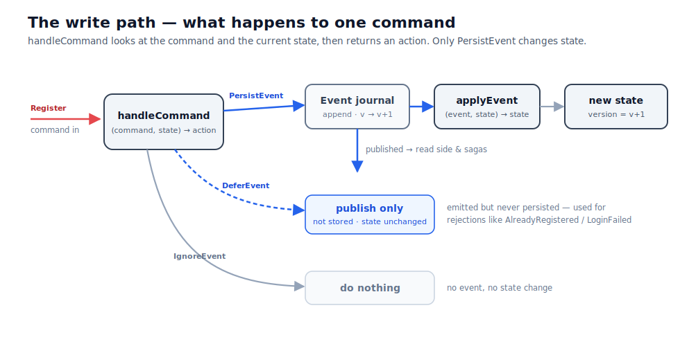

# Aggregates and the write side

An aggregate is easier to understand as a promise before it is understood as an actor or a type:
**all decisions for one identity inspect and change one current state, one at a time**.

For order 123, every `AddItem`, `Pay`, `Ship`, and `Cancel` command is routed to the same logical owner.
Commands for order 456 have a different owner and may run concurrently.

## Begin with the rule that must never race

Suppose an order can be cancelled only before shipping. Two requests arrive together: `ShipOrder` and
`CancelOrder`. If separate request handlers load the same database row, both can observe “paid” and
both can pass their rule before either save becomes visible.

The aggregate boundary places the state and both decisions behind one queue. One command runs first,
produces an event, and changes current state. The second command sees that new state.

The guarantee is local to one aggregate identity. It does not lock all orders, and it does not make a
rule spanning an order, a warehouse item, and a payment account atomic.

> **Motivation:** Routing one identity through one queue turns “check the rule, then save” into one
> ordered decision. The second command cannot make its choice from the state that existed before the
> first command completed.

## Find the boundary from invariants

An **invariant** is a rule that must remain true after every accepted command. Examples include:

- an order cannot ship twice;
- a bank account cannot spend beyond its permitted limit;
- a document cannot be published before it exists.

Put the state needed to decide one invariant inside one aggregate. Do not start by copying a database
entity graph into aggregate state. Start from the decision and ask which facts it must inspect
atomically.

Larger boundaries can enforce more rules in one decision, but they also serialize more unrelated work,
recover longer histories, and create contention around one identity. Smaller boundaries increase
parallelism but move cross-boundary work into [sagas](sagas.html). The goal is the smallest boundary
that can decide the rule correctly.

## The domain has four parts

An FCQRS aggregate definition separates four values:

| Part | Question it answers | Order example |
|---|---|---|
| Command | What does the caller want? | `CancelOrder` |
| State | What must this aggregate remember to decide? | current lifecycle status |
| Event | What outcome occurred? | `OrderCancelled` |
| Initial state | What is true before any events exist? | no order yet |

It also provides two functions:

```text
decide : command + current state -> event action
fold   : event + current state   -> next state
```

`decide` contains the business rule. `fold` contains no decision: it applies an outcome that has
already happened.

For example:

```fsharp
let decide command state =
    match command, state with
    | CancelOrder, Shipped -> OrderAlreadyShipped |> DeferEvent
    | CancelOrder, Cancelled -> AlreadyCancelled |> DeferEvent
    | CancelOrder, _ -> OrderCancelled |> PersistEvent

let fold event state =
    match event with
    | OrderCancelled -> Cancelled
    | OrderAlreadyShipped
    | AlreadyCancelled -> state
```

<div class="cs-alt"></div>

```csharp
EventAction<OrderEvent> HandleCommand(OrderCommand command, OrderState state) =>
    (command, state) switch
    {
        (OrderCommand.CancelOrder, OrderState.Shipped) =>
            EventActions.Defer<OrderEvent>(new OrderEvent.OrderAlreadyShipped()),
        (OrderCommand.CancelOrder, OrderState.Cancelled) =>
            EventActions.Defer<OrderEvent>(new OrderEvent.AlreadyCancelled()),
        (OrderCommand.CancelOrder, _) =>
            EventActions.Persist<OrderEvent>(new OrderEvent.OrderCancelled()),
        _ => EventActions.Ignore<OrderEvent>()
    };

OrderState ApplyEvent(OrderEvent outcome, OrderState state) =>
    outcome is OrderEvent.OrderCancelled ? OrderState.Cancelled : state;
```

The real functions receive FCQRS command and event envelopes, but the domain relationship stays this
simple.

## Choose what becomes history

An `EventAction` tells FCQRS what to do with the outcome.

| Action | Stored | Folded live | Published to projections | Typical use |
|---|---:|---:|---:|---|
| Persist | yes | yes | yes | a fact needed for recovery |
| Defer | no | yes | no | a rejection or repeated verdict |
| Ignore | no | no | no | intentionally no outcome |

A persisted event increments the aggregate's persisted version. A deferred event does not. FCQRS
folds a deferred event in the live actor, but recovery cannot replay it because it is absent from the
journal. Its fold should therefore preserve state. If a deferred event changes state, that change
disappears after restart.

FCQRS also exposes actions for batches, explicit snapshots, publishing, and unhandled cases. The
[aggregate how-to](../how-to/define-an-aggregate.html) gives the complete action table. The conceptual
choice remains: persist every fact required to reconstruct the future decision state.

[Deferring, snapshots, and passivation](aggregate-lifecycle.html) follows the stored and transient
paths through recovery in detail.



## Recovery explains the purity rules

FCQRS keeps aggregate state in memory while the actor is active. When the actor starts again, it loads
the latest snapshot if one exists, then replays later journal events through `fold`.

That is why `fold` must not read the clock, generate an id, call HTTP, send e-mail, or write another
database. Replay is rebuilding memory, not repeating the past. Every value that affects future state
must already be inside the stored event.

Keep `decide` free of I/O as well. Put input such as the current time or a generated id into the command
before it reaches the aggregate. Durable cross-boundary work belongs in a saga. Best-effort work that
may safely be lost can use an async effect.

## The actor is the runtime boundary

In FCQRS, each active aggregate identity is represented by an Akka.NET actor. An actor processes one
mailbox message at a time. Cluster sharding locates the actor across nodes, so callers address the
aggregate by its type and entity id rather than by server.

Passivation may stop an idle actor. The next command activates it and recovery rebuilds state. The
actor is therefore not a permanently allocated object, and in-memory state is a cache of journaled
history rather than the source of truth.

Sequential processing prevents races *inside* the boundary. It does not guarantee that projections
are current, that a command to another aggregate succeeds, or that an external service performs an
operation exactly once.

## Test the model before the runtime

Because the rule and fold are functions, the most valuable tests do not start Akka.NET:

1. Given a state, send a command and assert the selected event action.
2. Given a state, apply one event and assert the next state.
3. Given a complete history, fold every event and assert the recovered state.
4. Verify every deferred event leaves recoverable state unchanged.

If those tests are difficult to write, the aggregate may own too many responsibilities or perform work
that belongs outside the decision.

## Check your boundary

Write one invariant as a sentence. List every fact needed to decide it. Give the owner a stable
identity. Then ask whether two instances may decide independently. If they cannot, they are probably
inside the same aggregate boundary. If the rule truly spans independent owners, model the temporary
inconsistency and coordinate it with a saga.

Chapter 1 of the [tutorial](../tutorial/1-the-aggregate.html) builds this model step by step. Use
[Define an aggregate](../how-to/define-an-aggregate.html) for the implementation recipe and
[Test your domain](../how-to/test-your-domain.html) for the test shapes.
