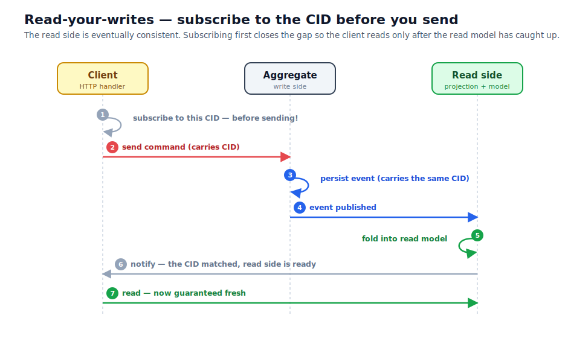

# Correlation IDs and read-your-writes

Suppose an API receives a request to cancel order 42. The request may produce a command, a stored
event, a projection update, several log entries, and perhaps saga work. Those messages happen at
different times and may run on different nodes. A **correlation id**, usually shortened to **CID**,
marks them as parts of the same request flow.

The CID answers “which request caused this work?” It does not answer “which order owns this state?”
Order 42's aggregate id remains 42. A single CID can pass through several aggregate identities, while
many requests for order 42 each receive their own CID.

```text
aggregate id: order-42       order-42       payment-9
correlation id: request-A -> request-A -> request-A
                command      event          saga command
```

## Follow one CID through the system

The application creates a CID at the boundary where one logical request begins. FCQRS carries it from
the command to the resulting event. Saga commands and their events retain the same request context,
and projection notifications expose it to subscribers.

That continuity supports two jobs:

- logs and traces can group activity produced by one request;
- an active caller can wait for the projection update produced by its command.

A CID is context, not a correctness guarantee. It does not serialize commands, deduplicate retries,
make delivery exactly once, or prove that every projection is current. Aggregate boundaries,
idempotency rules, journal writes, and projection offsets provide those guarantees separately.

## Why a successful command can still look stale

An aggregate replies after its event is stored. A projection consumes that event asynchronously, so a
query sent immediately after the reply may still see the previous read model.

```text
command -> aggregate -> journal -> projection -> read model
                         ^ durable   ^ may happen later
```

This is expected CQRS behaviour. The write side is current before the read side catches up.

> **Motivation:** Most requests can tolerate that short delay, so FCQRS does not make every write wait
> for every projection. Read-your-writes adds coordination only to the interaction that needs an
> immediately current view.

When the caller must read its own write, FCQRS uses the CID as a request-scoped rendezvous:

1. Create a CID.
2. Subscribe to the required projection's notifications for that CID.
3. Send the command with the same CID.
4. Wait while the aggregate stores the event and the projection commits its update.
5. Receive the projection notification.
6. Query that projection's read model.



## Subscribe before sending

Projection notifications are live signals. They are not retained for a caller that arrives later.
If the application sends first, a fast projection can publish before the subscription exists and the
caller can wait forever for a signal that already passed.

Subscribing first removes that race:

```text
unsafe: send -------- projection publishes -------- subscribe

safe:   subscribe --- send --- projection publishes --- wait completes
```

The journal event and projection offset are durable. The notification is deliberately ephemeral. It
coordinates one active request; it is not a queue for disconnected clients. Use a timeout or
cancellation token so the request has a defined outcome if the projection cannot catch up.

## Wait for the projection you will query

A notification means that the projection publishing it has finished handling the matching event. It
says nothing about another projection with its own offset.

For example, an order-details projection and a customer-history projection may consume the same event
at different speeds. If the response queries only order details, wait for that projection. If it
combines both models, wait for a completion signal from both or create one application-level signal
that represents the combined requirement.

One CID may also produce several events. A saga can cross aggregates, and one command can persist a
batch. Select the event that makes the required query safe, or wait for the correct number of matching
notifications. “First event with this CID” is correct only when the first event is the boundary the
caller needs.

## Deferred replies do not reach projections

A deferred rejection such as `OrderAlreadyShipped` is returned to the command caller but is not
stored. Because it never enters the journal, no journal projection can publish a notification for it.

FCQRS stamps the delivered reply to distinguish the paths:

- `Journaled = Some true`: a stored event can later reach a projection;
- `Journaled = Some false`: a deferred or publish-only reply will not reach a journal projection;
- `Journaled = None`: the envelope predates or bypassed that delivery stamp.

The `sendAwaiting` helper checks this value and skips the projection wait for a non-journaled reply.
Without that check, rejection paths could wait for notifications that can never exist.

## Keep the three identifiers separate

| Identifier | Scope | Question it answers |
|---|---|---|
| Aggregate id | one domain owner | Which order, account, or document owns this decision? |
| Correlation id | one request flow | Which commands, events, logs, and notifications belong together? |
| Message id | one envelope | Which individual command or event is this? |

Reusing an aggregate id as a CID mixes concurrent requests for the same entity. Reusing one global CID
mixes unrelated work. Create a fresh CID for each logical request and let FCQRS carry it through the
work caused by that request.

## Put it into practice

Chapter 2 of the [tutorial](../tutorial/2-running-it.html) runs a complete command, projection, and
query flow. [Read your writes](../how-to/read-your-writes.html) provides the F# and C# APIs, including
filters, multiple notifications, cancellation, and `sendAwaiting`. [Observe your
system](../how-to/observability.html) shows how the same CID appears in logs and traces.
