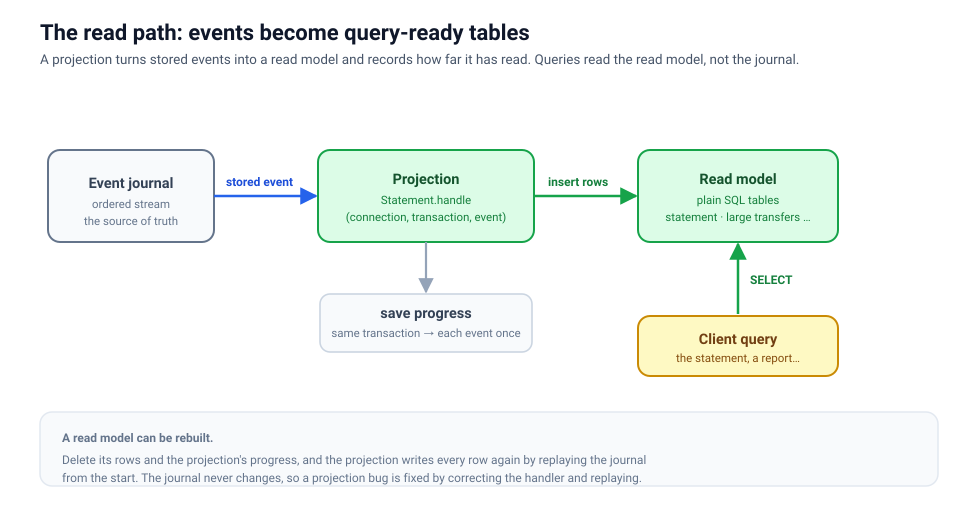

# The read side: from facts to answers

The journal is excellent at preserving what happened. It is a poor shape for most questions a user
asks.

A statement page wants one query-ready result: the owner, every deposit, withdrawal, and transfer with
its memo, and the balance after each. Loading the account and scanning its event history for every
page request would make queries slow and couple the user interface to write-side internals.

The read side exists to turn stored facts into useful answers ahead of time.

> **Motivation:** A projection pays the transformation cost once as events arrive. Queries can then
> read the shape they need directly instead of rebuilding histories and joining write-side state on
> every request.

## Projection and read model are different things

A **projection** is the event-handling process. A **read model** is the data it produces.

For example:

```text
Opened           -> insert a statement row with a balance of 0
Deposited        -> insert a row, balance = previous balance + amount
TransferSent     -> insert a row, balance = previous balance - amount
```

The read model may be a SQL table, document, search index, graph, or cache. Its shape follows a query,
not the aggregate state or event schema. It may duplicate names and totals if that makes reads direct
and understandable.



Several projections can consume the same event. `TransferSent` might update a statement, a list of
large transfers, a fraud review queue, and a monthly report. Those read models can evolve
independently because they share facts rather than one schema.

## Track progress per aggregate

A projection records how far it has handled each aggregate's events: the version of the last event it
handled for that account. After a restart, it continues after that version.

```text
alice   1 Opened   2 Deposited 100   3 Withdrawn 30    handled through version 2
bob     1 Opened                                       handled through version 1
```

The projection handles Alice's version 3 next. It does not ask each aggregate for current state. The
journal is the source; the handled versions are the projection's bookmarks.

> **Motivation:** The journal also numbers all events in one sequence, but a database that runs several
> writes at once gives a write its number when the write starts, and shows it when the write commits. A
> slow write can appear after higher-numbered ones. A projection that only remembered "handled through
> number 42" would pass over it and never handle it. An aggregate's versions have no such holes: one
> actor stores them one after another, so a projection that follows each aggregate's versions cannot
> skip an event.

The price is order across aggregates. A projection handles each aggregate's events in version order,
but events of different aggregates reach it in no particular order relative to each other.

A projection keeps its progress in one of three places:

- in memory, so it reads the whole journal again each time it starts, for a read model kept in memory;
- in the journal database under the projection's name, so it resumes where it stopped;
- in the read model's own database, committed together with each read-model change, which is what the
  transactional projection in the [tutorial](../tutorial/show-a-statement.html) does.

## The transaction boundary creates reliable progress

For a SQL read model, handle one event like this:

1. Begin a database transaction.
2. Apply the read-model insert, update, or delete.
3. Store the aggregate's new version as the projection's progress, in the same transaction.
4. Commit.

If the process stops before commit, neither change is durable and the event is retried. If commit
succeeds, both the data and progress are durable. This prevents the two dangerous split states:

- data changed but progress did not advance, so a non-idempotent update runs twice;
- progress advanced but data did not change, so the event is skipped forever.

Within one transactional store, this produces one committed update per event. If a projection writes
to SQL and a search service, those systems do not share the transaction. A projection that stores its
progress under a name stores it after its handler returns, so a crash in between hands the same event
to the handler again. The handler must then use idempotency, an outbox (staging the external write in
the local transaction and relaying it afterwards), or another explicit coordination design.

## Event order is part of the model

A projection should make invalid histories visible. If `Deposited` arrives for an account whose
`Opened` the projection never saw, silently inventing a partial row hides a broken contract or rebuild. Failing the projection exposes the
problem at the event that caused it.

Handlers should also define how repeated or superseded facts behave. Committing progress with the data
prevents normal repeats in one store, but rebuild tools, migrations, or external writes may still benefit from
idempotent operations keyed by event identity.

## Queries use only the read model

Application queries do not load aggregate actors or inspect the journal. They read the structure
created for them. This keeps query latency and indexing independent from write-side recovery and
business rules.

A read model is allowed to be stale for a short time. The aggregate commits first; the projection
commits later. This is **eventual consistency**. It is not lost data, but it changes what the caller may
observe immediately after a command.

## Read your own write when the interaction needs it

Some interactions can redirect immediately and allow the page to catch up. Others must show the new
result before replying. FCQRS carries a correlation id from the command to its event, so an active
caller can subscribe to that id before sending and wait until the required projection publishes the
matching event. [Correlation IDs and read-your-writes](correlation-ids.html) develops the full
request flow: the subscribe-before-send ordering, deferred replies that skip the wait, and the
timeouts that bound it.

## Read models are disposable, rebuilds are not casual

Because every read-model value is derived from retained events, it can be rebuilt:

1. stop or isolate the live projection;
2. create or clear the target schema;
3. give the projection a new name, so it starts from the first event;
4. replay and monitor failures;
5. validate counts and representative queries;
6. switch traffic to the rebuilt model.

“Disposable” means the journal can reproduce the data. It does not mean deleting a production view is
risk-free. Large replays take time, old events must remain deserializable, and a broken projection may
fail halfway through. A side-by-side rebuild often provides the safest rollback.

## Design one read model per question

Start from a consumer and a query, not from the event types. Write the result shape the consumer would
like to receive in one read. Then determine which events create and update it, which fields need
indexes, and how the projection handles missing or out-of-order facts.

The [tutorial's statement](../tutorial/show-a-statement.html) puts these ideas into a running program.
Use [Add a projection](../how-to/add-a-projection.html), [Read your writes](../how-to/read-your-writes.html),
and [Rebuild a read model](../how-to/rebuild-a-read-model.html) for focused implementation recipes.
