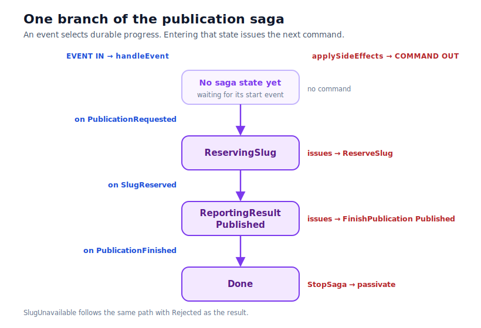
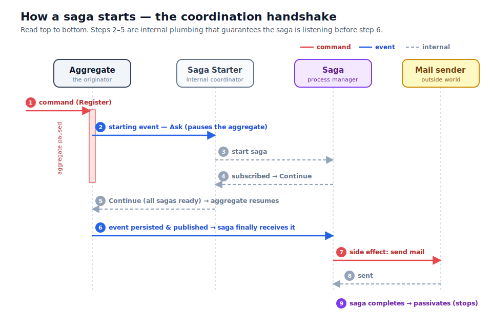

# Sagas

An [aggregate](aggregates.html) is forbidden from doing anything but decide and emit events. So who
sends the verification e-mail, requests the approval, charges the card? A **saga** does. A saga is the
mirror image of an aggregate: an aggregate turns commands into events; a saga turns events into
commands.

## A small, durable state machine

A saga wakes in response to an event, walks through a sequence of states, and along the way issues
commands to other actors — "generate a code," "send the mail," "approve" — until it stops. It is
itself a persistent, sharded actor, so it survives restarts and resumes where it left off.

The crucial design point is that a saga issues **commands** rather than performing effects inline.
That is what makes "send an e-mail" reliable rather than fire-and-forget: the command flows through
the same persist-and-recover machinery as everything else, can be retried, can be delayed (which is
how you build retry-with-backoff), and leaves a trail. Side effects become first-class, recoverable
steps instead of hidden calls.

You write a saga as three functions: one that maps an incoming event to the next state, one that — on
entering a state — decides which commands to issue and whether to stay, advance, or stop, and a small
one that folds cross-step data forward. The [tutorial](../tutorial/index.html) builds one; the
[how-to guide](../how-to/write-a-saga.html) is the recipe.

## Starting a saga safely

There is one subtlety worth understanding, because it explains a piece of machinery you would
otherwise wonder about. When an aggregate emits an event that is supposed to *start* a saga, there is
a chicken-and-egg problem: the event must not be published to the world until the saga that cares
about it exists and is subscribed — otherwise the saga could miss the very event meant to bring it to
life.

FCQRS solves this with a brief handshake coordinated by an internal **saga starter**. Before the
aggregate publishes the triggering event, it pauses just long enough for the framework to confirm the
relevant saga is alive and listening; only then does the event go out. You never write that dance —
you simply declare "this event starts that saga," and the ordering is guaranteed. The upshot: sagas
start safely, by construction.

## Recovery without duplicate effects

Because a saga's state is reconstructed by replaying its events, naïvely re-running its
command-issuing logic on every replayed state would re-fire every command after a restart — a second
approval, a duplicate e-mail. The framework hands your logic a `recovering` flag so it can suppress
those re-emissions, and it separately uses [version checks](consistency-and-recovery.html) to detect
when an aggregate has restarted underneath a saga and abort rather than act on stale information.
Between the two, restarts stop being a source of duplicate or contradictory side effects.

## Where sagas fit

Reach for a saga whenever an event should trigger work that lives *outside* the deciding aggregate:
calling another aggregate, talking to the outside world, or orchestrating a multi-step workflow. Keep
the orchestration simple and avoid circular dependencies between sagas — the
[reliability notes](consistency-and-recovery.html) discuss the failure modes that careless
orchestration can still produce.
