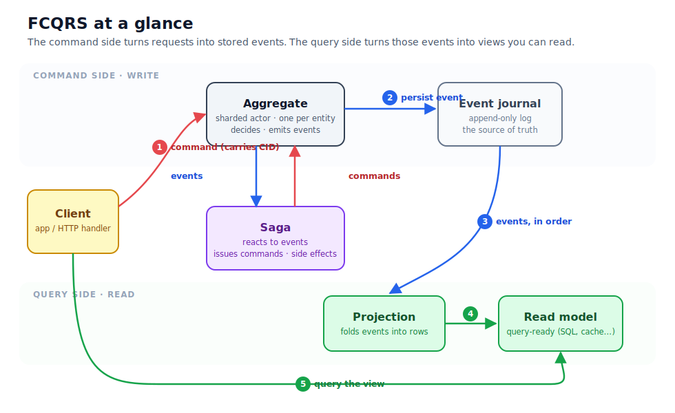
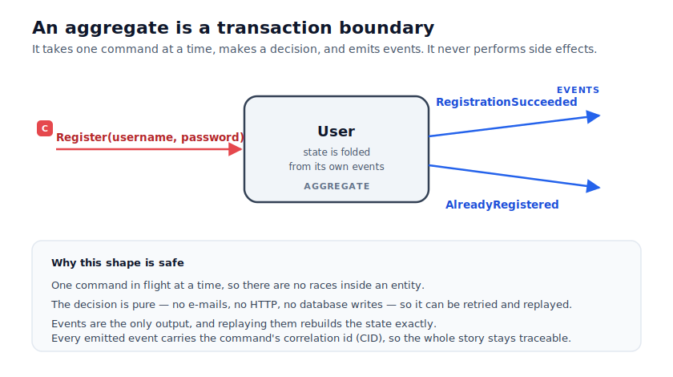

# Part 2 — The cast of characters

Part 1 made the argument; this part introduces the actors that carry it out. There is still almost
no code here — the goal is to leave you with a single picture in your head, so that when the code
arrives in Part 3 you already know where each piece belongs.

Here is the whole system on one diagram. Do not try to absorb it all at once; we will walk through
it one box at a time, and you can return to it whenever you lose the thread.

Read it left to right along the top, then down the middle, then left to right along the bottom. A
request enters as a **command**, an **aggregate** decides what happened and appends an **event** to
the **journal**, those events flow down to a **projection** that builds a **read model**, and the
client eventually **queries** that read model. Off to the side, a **saga** watches the events and
issues new commands of its own. That is the entire shape. Everything else is detail.

## The aggregate: where decisions happen

An aggregate is the write side's unit of consistency. In FCQRS it is an Akka.NET actor — there is
exactly one live instance per entity (one `User`, one `Document`), and it processes its messages one
at a time. That single fact removes a whole category of bugs: because only one command is ever in
flight inside a given aggregate, there are no locks to take and no races to lose.

The shape of an aggregate is always the same. A **command** comes in — a *request* to change
something, named in the imperative: `Register`, `CreateOrUpdate`. The aggregate looks at the command
and at its own current state, makes a decision, and emits zero or more **events** — *facts*, named
in the past tense: `RegistrationSucceeded`, `AlreadyRegistered`. The command is a wish; the event is
what actually happened.

The discipline that makes this trustworthy is what the aggregate is *not* allowed to do. It does not
send e-mail, call an HTTP API, or write to a database. It only decides and emits events. There are
two reasons for this restraint, and they are worth internalising now because they explain much of
the framework's design. First, a pure decision can be retried and replayed safely — running it
again produces the same events and no duplicate side effects, because there were no side effects.
Second, because the events are the only output, replaying them is enough to rebuild the aggregate's
state exactly. State is not something the aggregate stores and protects; it is something the
aggregate *derives* by folding its own past events. We will see that fold function in Part 3 and
lean on this replay property heavily in Part 4.

One last detail on the diagram you should notice early: every event carries the **correlation id**
of the command that caused it. Hold that thought — it is how the whole story stays traceable, and it
is the key to the client coordination in Part 6.

## The event journal: the source of truth

When an aggregate decides to persist an event, the event is appended to the **journal** — an
append-only log, backed by a database (SQLite in our examples, but it can be anything Akka.NET
persistence supports). Nothing is ever updated in place; events are only ever added to the end.

This log is *the* source of truth for the write side. It is not a copy of the truth kept alongside
some other authoritative store — it is the thing itself. The aggregate's in-memory state is a
convenience derived from the log; the read models are convenience derived from the log; if you
deleted everything except the journal, you could rebuild all of it. Keeping that hierarchy straight
in your mind — journal first, everything else downstream — is most of what it takes to reason about
an event-sourced system.

## The projection and the read model: turning events into answers

A **projection** is a small piece of code that consumes events in the order they were written and
folds them into a **read model** — a structure shaped for querying. In Focument the read model is a
couple of ordinary SQLite tables; one row per current document, plus a history table with one row
per version. The projection's whole job is: when a `CreatedOrUpdated` event arrives, upsert the
document row and append a history row; when an `Approved` event arrives, flip a status column.

Two properties of projections matter from the start. The first is that a projection remembers *how
far it has read* — an **offset** into the event stream — so that after a restart it resumes from
where it left off rather than reprocessing everything. The second is the one from Part 1, now made
concrete: because a projection is built entirely from the journal and stores nothing the journal
does not already imply, you can delete a read model and rebuild it from scratch by replaying events
through the projection from offset zero. The read model is disposable. The journal is not.

## The saga: making side effects reliable

So far the aggregate is forbidden from doing anything but decide, and the projection only ever reads.
Somebody, somewhere, still has to send the verification e-mail. That somebody is a **saga**.

A saga is the mirror image of an aggregate. An aggregate takes commands and emits events; a saga
takes events and issues commands. It is a small, long-lived state machine that wakes up in response
to an event — say, `VerificationRequested` — walks through a sequence of states, and along the way
tells other actors what to do: generate a code, send the mail, and eventually stop. Because a saga
issues *commands* rather than performing effects inline, those steps inherit the same retry and
recovery story as everything else, which is what makes "send an e-mail" reliable rather than
fire-and-forget.

There is one subtlety in *starting* a saga that is worth seeing now, because it explains a piece of
internal machinery you will otherwise wonder about. When an aggregate emits an event that is
supposed to start a saga, we have a small chicken-and-egg problem: the event must not be published to
the world until the saga that cares about it actually exists and is subscribed — otherwise the saga
could miss the very event that was meant to bring it to life. FCQRS solves this with a brief
handshake, coordinated by an internal actor called the **saga starter**.

Read the sequence top to bottom. The aggregate, before publishing its event, pauses and asks the
saga starter to make sure the relevant saga is alive and subscribed. Only once that is confirmed
does the event go out — at which point the saga is guaranteed to receive it. Steps 2 through 5 are
plumbing you never write; you simply declare "this event starts that saga," and the framework
guarantees the ordering. We will write that declaration in Part 7. For now the takeaway is just
that sagas start *safely*, by construction.

## The correlation id: one thread through the whole story

The last character is not a box on the diagram but a value that travels through all of them: the
**correlation id**, or CID. A CID is minted when a request begins and is copied onto the command,
onto every event the command produces, onto the saga's follow-up commands, and onto their events in
turn. Follow a single CID and you can see one user action ripple through the entire system.

Its most practical use solves the oldest annoyance in CQRS. The read side is *eventually*
consistent — there is a small gap between an aggregate persisting an event and a projection folding
it into the read model. Naively, a client that sends a command and immediately queries might read
stale data. FCQRS closes that gap with a simple rule we will practise in Part 6: the client
**subscribes to its CID before sending the command**, and then waits. When the projection has
processed the event carrying that CID, the client is notified — and only then does it read. No
polling, no "save and pray," just a clean signal that the read side has caught up.

## Why actors, underneath all this

It is fair to ask why all of this rides on an actor framework rather than plain functions and a
database. The answer is that the actor model gives us, almost for free, the properties this design
needs. One-message-at-a-time processing gives each aggregate a clean transaction boundary with no
locking. Cluster sharding lets the same logical aggregate live on any node and move between them,
so the system scales horizontally without you addressing machines by hand. Passivation lets idle
entities be put to sleep and recovered on demand, so millions of entities cost only as much memory
as the active ones. FCQRS's job is to hide that Akka.NET machinery behind the small vocabulary you
have just met — aggregate, event, projection, saga, CID — so that you spend your attention on the
domain and not on the distribution.

You now have the whole cast. In [Part 3](part-3-your-first-aggregate.md) we stop talking and build
one: the `User` aggregate from `saga_sample`, in F# and in C#, with its commands, its events, its
decide function, and its fold.
