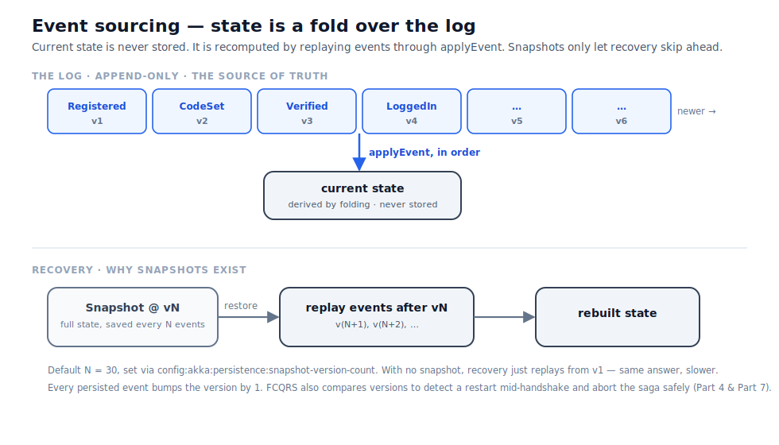

# Part 4 — Event sourcing in practice

In Part 3 we built an aggregate and saw that its state is folded from events rather than stored
directly. That sentence is easy to nod along to and easy to underestimate. This part makes it
concrete: what actually happens when an actor wakes up, why there is a version number on everything,
and what snapshots are really buying you.

## State is a fold, and that is the whole trick

Here is the mental model in one picture. The journal is a list of events in the order they happened.
The current state is what you get by starting from the initial state and applying each event in
turn — exactly the `applyEvent` function from Part 3, run down the list.

Nothing stores "the user's current state" as a row somewhere. When the `User` actor for a particular
username starts up — because a command arrived and the cluster brought the entity to life — the
framework reads that user's events from the journal and replays them through `applyEvent`, one by
one, rebuilding the in-memory state from nothing. By the time the new command is handled, the state
is precisely what it would have been had the actor never stopped. The actor cannot tell the
difference between "I have been running all along" and "I was just reconstituted from my events,"
and that is the point.

This is why `applyEvent` had to be dull and pure. It runs in two situations that must produce
identical results: once when a brand-new event is persisted, and many times when old events are
replayed during recovery. If it did anything other than fold the event into the state — if it sent
a message, or looked at the clock, or made a decision — replay would not faithfully reproduce
history, and the whole edifice would wobble. Keeping the fold pure is what makes replay trustworthy.

## Versions: counting what happened

Every time an aggregate persists an event, its **version** increments by one. The first persisted
event leaves the aggregate at version 1, the second at version 2, and so on. The version travels on
the event itself, which is why, back in `saga_sample`, the command functions can return it — when
you register a user, the `VerificationRequested` event comes back carrying the version the aggregate
reached, and the caller can use it as a logical timestamp for "how far along is this entity."

Two details about versioning are worth pinning down now, because they explain behaviour you would
otherwise find surprising.

The first is that **deferred events do not increment the version.** Recall from Part 3 that a
rejection like `AlreadyRegistered` is emitted with `DeferEvent` — published so the caller hears it,
but never written to the journal. Since nothing was appended, there is nothing to count, and the
version stays put. The version measures *what happened to the entity*, not *how many commands it
declined*.

The second is that the version is what lets the framework notice a restart at an awkward moment.
When a saga and an aggregate are mid-conversation and the aggregate is restarted underneath them, the
saga might still be holding an event from the aggregate's previous life. FCQRS catches this by
comparing versions: if the version the saga is carrying no longer matches the aggregate's current
version, the framework concludes a restart happened and aborts that saga rather than letting it act
on stale information. You do not write any of this; it is part of the handshake we will meet
properly in Part 7. For now, just file away that the version is not bookkeeping for its own sake —
it is load-bearing for consistency across restarts.

## Snapshots: skipping the boring middle

Replaying every event from the beginning is correct, but for a long-lived entity with thousands of
events it would make waking up slow. Snapshots fix that without changing the model at all.

Every *N* persisted events, FCQRS saves a **snapshot**: the full current state, written aside as a
single record tagged with the version it represents. On recovery, instead of replaying from the
very first event, the framework loads the most recent snapshot, restores the state directly from it,
and then replays only the handful of events that came *after* it. The answer is identical to a full
replay — the snapshot is just a memo of "here is where you would have got to by version *N*, so you
can start there." That is the lower band of the diagram above.

Because a snapshot is only an optimisation, deleting all of them changes nothing but startup speed:
recovery falls back to replaying from the first event and arrives at exactly the same state. Like a
read model, a snapshot is disposable; unlike the journal, it is never the source of truth.

*N* defaults to 30 and is configured through HOCON under the key
`config:akka:persistence:snapshot-version-count`. We will see where that key lives, and how the rest
of the configuration is assembled, in Part 9. Both aggregates and sagas snapshot on the same
mechanism, so a long-running saga benefits from this just as an aggregate does.

## Why this matters beyond performance

It is tempting to read this part as a set of implementation details — replay, versions, snapshots —
but the reason event sourcing is worth its ceremony is upstream of all of them, and it is the
promise from Part 1 now made literal.

Because the journal holds the events and the state is *only ever derived* from them, you are never
stuck with a corrupted or mismodelled current state. Get the shape of your read model wrong and you
fix the projection and rebuild it. Realise months later that an aggregate should have tracked one
more field, and you add it to the state and to `applyEvent`, restart, and let replay fill it in from
events that were always there. The events are the facts; everything downstream — in-memory state,
snapshots, read models — is a re-derivable opinion about those facts. That asymmetry is the quiet
superpower of the whole approach, and versions and snapshots are simply how FCQRS makes living with
it fast and safe.

In [Part 5](part-5-the-read-side.md) we cross over to the query side and watch those same events
become something you can actually run a `SELECT` against.
