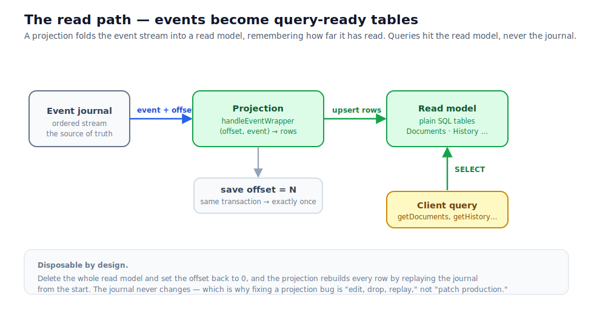

# Part 5 — The read side

Up to now our example has been `saga_sample`, whose read side is deliberately a stub — it logs each
event and moves on. That was the right size for learning the write path. To see a *real* read model
we graduate to **Focument**, the document-versioning app, which keeps a proper SQLite read model and
will carry us through the rest of the workshop. The F# is from
[`focument`](https://github.com/onurgumus/focument); the C# is from `focument-csharp`; they are line-for-line
siblings.

Here is the shape we are filling in. Events flow out of the journal into a projection, the projection
folds them into tables, and queries read those tables — never the journal.



## A projection is just a fold with a side table

A projection is a function that the framework calls once per event, in stream order. Focument's is
called `handleEventWrapper`, and its signature tells you everything it is handed: a logger, a
connection string, the event's **offset** (its position in the stream), and the event itself.

```fsharp
// focument/src/Server/Projection.fs
let handleEventWrapper (loggerFactory: ILoggerFactory) (connString: string)
                       (offsetValue: int64) (event: obj) =
    use conn = new SqliteConnection(connString)
    conn.Open()
    use transaction = conn.BeginTransaction()

    let dataEvent =
        match event with
        | :? Event<Event> as docEvent ->
            match docEvent.EventDetails with
            | CreatedOrUpdated doc ->
                // upsert the current-state row in Documents,
                // and append a row to DocumentVersions (the history)
                // … Dapper INSERT/UPDATE here …
                [ docEvent :> IMessageWithCID ]
            | Approved docId ->
                conn.Execute(
                    "update Documents set ApprovalStatus = 'Approved' where Id = @Id",
                    {| Id = (ValueLens.Value docId).ToString() |}, transaction) |> ignore
                [ docEvent :> IMessageWithCID ]
            | _ -> []
        | _ -> []

    // advance the offset *in the same transaction* as the row writes
    conn.Execute(
        "update Offsets set OffsetCount = @Offset where OffsetName = @Name",
        {| Offset = offsetValue; Name = "DocumentProjection" |}, transaction) |> ignore

    transaction.Commit()
    dataEvent
```

```csharp
// focument-csharp/src/Server/Projection.cs
public static IList<IMessageWithCID> HandleEventWrapper(
    ILoggerFactory loggerFactory, string connString, long offsetValue, object eventObj)
{
    using var conn = new SqliteConnection(connString);
    conn.Open();
    using var transaction = conn.BeginTransaction();
    var dataEvents = new List<IMessageWithCID>();

    if (eventObj is FCQRS.Common.Event<DocumentEvent> docEvent)
    {
        if (docEvent.EventDetails is DocumentEvent.CreatedOrUpdated created)
        {
            // upsert Documents + append to DocumentVersions  (Dapper)
            dataEvents.Add(docEvent);
        }
        else if (docEvent.EventDetails is DocumentEvent.Approved approved)
        {
            conn.Execute(
                "UPDATE Documents SET ApprovalStatus = 'Approved' WHERE Id = @Id",
                new { Id = approved.DocumentId.Value.ToString() }, transaction);
            dataEvents.Add(docEvent);
        }
    }

    // advance the offset in the same transaction as the row writes
    conn.Execute(
        "UPDATE Offsets SET OffsetCount = @Offset WHERE OffsetName = @Name",
        new { Offset = offsetValue, Name = "DocumentProjection" }, transaction);

    transaction.Commit();
    return dataEvents;
}
```

Three things in that code are worth dwelling on, because they are the load-bearing ideas of the
whole read side.

**It pattern-matches the event and writes plain rows.** There is nothing clever here — a
`CreatedOrUpdated` upserts a row in `Documents` and appends one to `DocumentVersions`; an `Approved`
flips a status column. The read model's shape is chosen entirely for the queries it has to answer
(one row per current document, one row per historical version), with no obligation to resemble the
events or the aggregate's state. That freedom is the entire point of separating reads from writes.

**It advances the offset in the same transaction as the writes.** The offset is "how far through the
stream this projection has read," stored in an `Offsets` table. Because the row writes and the offset
bump commit together, the projection is *exactly once* even across a crash: either both happen or
neither does, so on restart it resumes from precisely the right place and never double-applies or
skips an event. This atomic-offset trick is the single most important habit to copy when you write
your own projection.

**It returns a list of events.** The events the handler returns (`[ docEvent ]`, or `dataEvents`) are
republished onto the framework's subscription stream. That return value is easy to overlook, but it
is the bridge to the next part: it is how a client waiting on a correlation id finds out the read
model has caught up. A projection that returns `[]` for an event updates the database silently; one
that returns the event lets subscribers react. We will lean on exactly this in Part 6.

(The schema itself is created once at startup by an idempotent `ensureTables` / `EnsureTables` that
runs the `CREATE TABLE IF NOT EXISTS` statements and seeds the offset row to zero. It is ordinary
SQL, so we will not dwell on it.)

## Queries: ordinary SQL against the read model

Because the read model is just tables, queries are just queries. Focument uses Dapper and never
touches the event store on the read path.

```fsharp
// focument/src/Server/Query.fs
let getDocuments (connString: string) : Query.Document list =
    use conn = new SqliteConnection(connString)
    conn.Open()
    conn.Query<Query.Document>(
        "select Id, Title, Body, Version, CreatedAt, UpdatedAt
         from Documents order by UpdatedAt desc")
    |> Seq.toList

let getDocumentHistory (connString: string) (docId: string) : Query.DocumentVersion list =
    use conn = new SqliteConnection(connString)
    conn.Open()
    conn.Query<Query.DocumentVersion>(
        "select Id, Version, Title, Body, CreatedAt
         from DocumentVersions where Id = @Id order by Version desc",
        {| Id = docId |})
    |> Seq.toList

// remembers where the projection left off, so it resumes after a restart
let getLastOffset (connString: string) : int64 =
    use conn = new SqliteConnection(connString)
    conn.Open()
    conn.QueryFirstOrDefault<int64>(
        "select OffsetCount from Offsets where OffsetName = @Name",
        {| Name = "DocumentProjection" |})
```

The C# `ServerQuery` is the same three queries with the same SQL, returning C# DTOs instead of F#
records. The read DTOs on both sides are intentionally dumb — plain fields, no validation, no
behaviour — because their only job is to be shaped conveniently for the screen that displays them.

`getLastOffset` is the small but crucial counterpart to the atomic offset write. When the
application boots, it reads this value and starts the projection stream from there, so a restart
picks up exactly where the last commit left it. You will see that wiring — `Query.init` taking the
last offset and the handler — when we assemble the whole application in Part 8.

## Why a read model is disposable

We claimed back in Part 1 that you can throw a read model away and rebuild it. Now you can see
precisely why that is true. Everything in those SQLite tables was put there by `handleEventWrapper`,
folding events the journal still holds. So if a projection has a bug — it computed a status wrong, or
you want an entirely new table — you fix the handler, delete the read-model database, reset the
offset to zero, and let the stream replay from the beginning. The corrected projection rebuilds every
row from events that never changed. No production data surgery, no migration scripts against
mismodelled state: edit, drop, replay.

That asymmetry — journal permanent, read model regenerable — is what lets the read side evolve freely
without ever endangering the truth.

In [Part 6](part-6-client-coordination.md) we use the list of events this projection returns to solve
the oldest annoyance in CQRS: telling the client, precisely, when its change is visible.
